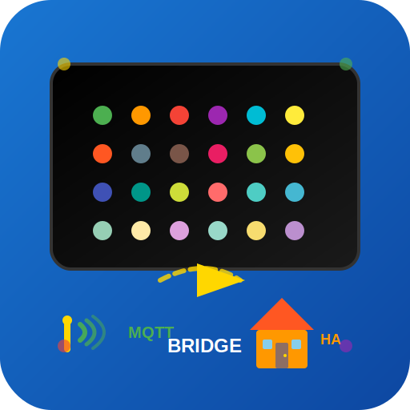

# 🎨 Awtrix MQTT Bridge for Home Assistant

<div align="center">
  
</div>

[](https://github.com/hacs/integration)
[](https://github.com/chr-braun/awtrix-mqtt-bridge/releases)
[](LICENSE)

> ⚠️ **Work in Progress (v1.0.1)** - This integration is actively being developed and improved. Recent fixes include MQTT callback API compatibility and enhanced debugging capabilities. Please report any issues you encounter!

A user-friendly Home Assistant integration that automatically forwards MQTT sensor data to Awtrix displays - with complete GUI support!

## ✨ Features

- **🖱️ Smart Sensor Discovery**: Auto-discovery with searchable dropdown
- **🎨 Live Preview**: Real-time preview of display appearance with effects
- **🔍 Icon Browser**: Visual icon selection with popular presets
- **🏷️ Smart Templates**: Pre-configured setups for weather, energy, and smart home
- **🤖 Context-Aware Suggestions**: Auto-suggests icons and settings based on sensor type
- **📡 Auto-Discovery**: Automatic detection of MQTT sensors
- **⚙️ MQTT Configuration**: Easy setup via GUI (no YAML required)
- **🔄 Live Updates**: Real-time transmission of sensor values
- **🌈 Advanced Effects**: Scrolling text, fade, blink, rainbow effects with preview
- **🎯 Multi-Slot Support**: Configure up to 8 sensors on different display slots
- **📊 Status Monitoring**: Built-in sensors for connection status and mapping count
- **📱 Mobile-First Design**: Fully responsive interface for all devices
- **🌙 Dark Mode**: Automatic dark/light theme support

## 📋 Requirements

- Home Assistant 2023.5.0 or newer
- MQTT broker (e.g., Mosquitto)
- Awtrix 3 device with firmware 0.96 or newer
- MQTT integration enabled in Home Assistant

## 🚀 Installation

### Via HACS (Recommended)

1. Open HACS in Home Assistant
2. Go to "Integrations"
3. Click "+ Explore & Download Repositories"
4. Search for "Awtrix MQTT Bridge"
5. Install the integration
6. Restart Home Assistant

### Manual Installation

1. Download the latest release from [GitHub Releases](https://github.com/chr-braun/awtrix-mqtt-bridge/releases)
2. Extract the `custom_components/awtrix_mqtt_bridge/` folder to your `config/custom_components/` directory
3. Restart Home Assistant

## ⚙️ Configuration

### Initial Setup

1. Go to **Settings** → **Devices & Services**
2. Click **"+ Add Integration"**
3. Search for **"Awtrix MQTT Bridge"**
4. Follow the setup wizard:
   - **MQTT Configuration**: Enter your MQTT broker details
   - **Awtrix Configuration**: Enter your Awtrix device IP and port

### Adding Sensor Mappings

After installation, you can map sensors to your Awtrix display using the built-in services:

#### Using the GUI (Developer Tools → Services)

1. Go to **Developer Tools** → **Services**
2. Select service **"Awtrix MQTT Bridge: Add sensor to Awtrix"**
3. Configure the mapping:
   - **Sensor Entity ID**: Choose any Home Assistant sensor
   - **Slot ID**: Display slot (1-5)
   - **Display Name**: Custom name for the display
   - **Icon ID**: Awtrix icon ID (1-5000)
   - **Text Color**: RGB color in hex format
   - **Text Effect**: Visual effects (none, scroll, fade, blink, rainbow)
   - **Display Duration**: How long to show the data (seconds)
   - **Text Format**: Format string using `{value}` placeholder

#### Using YAML Automation

```yaml
service: awtrix_mqtt_bridge.add_sensor_mapping
data:
  sensor_entity_id: sensor.outdoor_temperature
  slot_id: 1
  display_name: "Outside"
  icon_id: 2422  # Weather icon
  text_color: "#00FF00"
  text_effect: "scroll"
  display_duration: 10
  text_format: "{value}°C"
```

## 🎮 Available Services

### `awtrix_mqtt_bridge.add_sensor_mapping`
Adds a sensor to an Awtrix display slot with custom formatting.

### `awtrix_mqtt_bridge.remove_sensor_mapping`
Removes a sensor mapping from the display.

### `awtrix_mqtt_bridge.send_to_awtrix`
Manually sends all current mappings to the Awtrix display.

### `awtrix_mqtt_bridge.clear_all_mappings`
Clears all sensor mappings.

## 📊 Built-in Sensors

The integration provides these sensors for monitoring:

- **Awtrix MQTT Bridge Status**: Shows connection status (connected/disconnected)
- **Awtrix Active Mappings**: Shows number of active sensor mappings

## 🎨 Icon Reference

Awtrix supports thousands of icons. Popular ones include:

- **Weather**: 2422 (sun), 2423 (cloud), 2424 (rain)
- **Temperature**: 2109 (thermometer)
- **Humidity**: 51658 (water drop)
- **Home**: 2313 (house)
- **Energy**: 2114 (lightning bolt)

Find more icons at: [Awtrix Icon Database](https://developer.lametric.com/icons)

## 🔧 Troubleshooting

### MQTT Connection Issues

If you're experiencing "MQTT connection timeout" or "no response from broker" errors:

#### 🔍 **Quick Test Tool**

Use the included test tool to diagnose MQTT issues:

```bash
# Download and run the test tool
wget https://raw.githubusercontent.com/chr-braun/awtrix-mqtt-bridge/main/mqtt_test.py
python3 mqtt_test.py <your_mqtt_host> <port> [username] [password]

# Examples:
python3 mqtt_test.py localhost 1883
python3 mqtt_test.py core-mosquitto 1883
python3 mqtt_test.py 192.168.1.100 1883 myuser mypass
```

#### 🏠 **Home Assistant Mosquitto Add-on**

```yaml
# Correct settings for HA Mosquitto add-on:
Host: core-mosquitto
Port: 1883
Username: (your HA username)
Password: (your HA password)
```

**Steps to verify:**
1. Go to **Supervisor → Mosquitto broker**
2. Ensure the add-on is **Started**
3. Check add-on logs for errors
4. Verify users are configured in add-on configuration

#### 🐳 **External MQTT Broker**

```yaml
# Settings for external broker:
Host: (IP address of MQTT server)
Port: 1883
Username: (MQTT username)
Password: (MQTT password)
```

**Common issues:**
- Firewall blocking port 1883
- MQTT broker not running
- Wrong IP address
- Authentication issues

#### 🔧 **Diagnostic Steps**

1. **Test network connectivity:**
   ```bash
   telnet <mqtt_host> 1883
   # Should connect if broker is reachable
   ```

2. **Check MQTT broker status:**
   ```bash
   # For Mosquitto:
   sudo systemctl status mosquitto
   
   # For Docker:
   docker ps | grep mosquitto
   ```

3. **Test MQTT directly:**
   ```bash
   # Subscribe test:
   mosquitto_sub -h <host> -p 1883 -t test/topic
   
   # Publish test:
   mosquitto_pub -h <host> -p 1883 -t test/topic -m "hello"
   ```

4. **Enable debug logging:**
   Add to `configuration.yaml`:
   ```yaml
   logger:
     logs:
       custom_components.awtrix_mqtt_bridge: debug
       paho.mqtt: debug
   ```

### Common Issues

**Connection Problems:**
- Verify MQTT broker is running and accessible
- Check Awtrix device IP and port (default: 7000)
- Ensure Home Assistant can reach both MQTT broker and Awtrix device

**Sensors Not Displaying:**
- Check if sensor exists in Home Assistant
- Verify MQTT integration is working
- Use Developer Tools → States to check sensor values

**Display Not Updating:**
- Check Awtrix device is online
- Verify custom app slots are enabled in Awtrix settings
- Try the "Send to Awtrix" service manually

### Error Messages Guide

| Error | Cause | Solution |
|-------|-------|----------|
| "Connection timeout" | MQTT broker not responding | Check broker status, verify host/port |
| "Connection refused" | Broker not running or wrong port | Start broker, check port 1883 |
| "Authentication failed" | Wrong credentials | Verify username/password |
| "Network not reachable" | Network/firewall issue | Check connectivity, firewall rules |
| "Protocol version not supported" | MQTT version mismatch | Update broker or client |

### Debug Logging

Enable debug logging in `configuration.yaml`:

```yaml
logger:
  logs:
    custom_components.awtrix_mqtt_bridge: debug
```

## 🤝 Contributing

Contributions are welcome! Please feel free to submit a Pull Request.

1. Fork the repository
2. Create your feature branch (`git checkout -b feature/AmazingFeature`)
3. Commit your changes (`git commit -m 'Add some AmazingFeature'`)
4. Push to the branch (`git push origin feature/AmazingFeature`)
5. Open a Pull Request

## 📄 License

This project is licensed under the MIT License - see the [LICENSE](LICENSE) file for details.

## 🙏 Acknowledgments

- [Awtrix](https://awtrixdocs.blueforcer.de/) for the amazing LED matrix platform
- [Home Assistant](https://www.home-assistant.io/) community for the excellent platform
- All contributors and users providing feedback

## ☕ Support

If you find this integration useful, consider buying me a coffee!

[](https://buymeacoffee.com/christianbraun)
